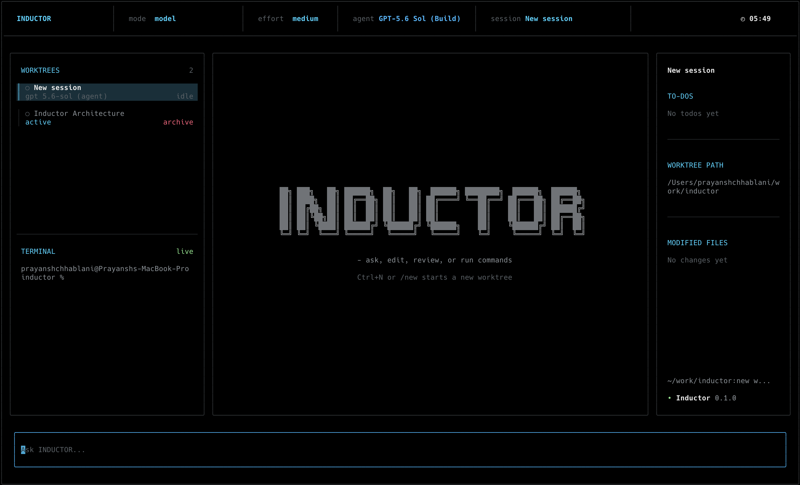
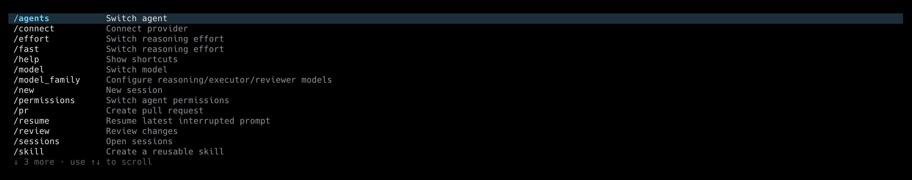

# Inductor

**Run multiple AI coding agents in parallel—without branch conflicts.**

Inductor is a terminal-native AI coding workspace for **Claude**, **OpenAI Codex**, and **GitHub Copilot**. Each agent runs in its own Git worktree and branch, so you can assign several tasks at once while keeping every change isolated.



## Why Inductor?

### Parallel agents, isolated by default

Start one agent to fix a bug, another to build a feature, and another to review the code. Every session gets its own:

- Git worktree and branch
- Conversation and task history
- Provider, model, and reasoning effort
- Terminal, modified-file list, and diff
- Permission policy

Press **Ctrl+N** or use `/new` to start another agent. Existing agents continue running while you move between sessions.

### Use the model you want

Inductor supports:

- **Claude** through Claude Code
- **OpenAI Codex** through Codex authentication
- **GitHub Copilot** through GitHub device login

Switch providers with `/connect` and models with `/model`.

### See and control the work

Inductor keeps the full coding workflow visible inside the terminal: tool calls, shell commands, file changes, to-dos, diffs, session history, and pull-request creation.

## Model vs. model family

| Mode | How it works | Best for |
| --- | --- | --- |
| **Model** | One provider and model handles the whole session | Fast, straightforward tasks |
| **Model family** | Separate reasoning, executor, and reviewer models cooperate in one worktree | Larger tasks that benefit from planning, execution, and independent review |

A model family follows this workflow:

```text
Reasoning → Executor → Reasoning check → Reviewer → Final decision
```

The roles may use different providers and effort levels. Model-family roles work sequentially inside one session; use `/new` when you want truly parallel agents.

## Quick start

Prebuilt releases currently support **Apple Silicon macOS**.

```sh
curl -fsSL https://raw.githubusercontent.com/prayanshchh/inductor/main/scripts/install.sh \
  | INDUCTOR_REPO=prayanshchh/inductor sh
```

Update an installed release in place:

```sh
inductor update
```

Authenticate with Claude Code or Codex before starting, or connect GitHub Copilot from inside Inductor.

```sh
cd path/to/your-project
inductor
```

Then enter a task:

```text
Find the cause of the failing authentication tests, fix it, and run the focused test suite.
```

Press **Ctrl+N** and give the next agent a separate task. Both agents can work at the same time in isolated branches.

## Commands

Type `/` to open the command palette.



| Command | Purpose |
| --- | --- |
| `/agents` | Switch between Build, Review, and Plan behaviour |
| `/connect` | Connect or switch Claude, Codex, or GitHub Copilot |
| `/effort` | Change reasoning effort |
| `/fast` | Open the reasoning-effort selector |
| `/help` | Show keyboard shortcuts |
| `/model` | Choose one model for the session |
| `/model_family` | Configure reasoning, executor, and reviewer models |
| `/new` | Start another parallel agent session |
| `/permissions` | Control approvals and workspace access |
| `/pr` | Commit, push, and create a pull request |
| `/resume` | Resume the latest interrupted prompt |
| `/review` | Review the current worktree changes |
| `/sessions` | Browse and reopen saved sessions |
| `/skill` | Create a reusable skill |
| `/skills` | Select reusable skills for prompts |
| `/clear` | Start a clean session |
| `/exit` | Exit Inductor |

## Built for parallel software work

Inductor is for developers who want more than a single AI chat window. It gives you a local control center where multiple coding agents can investigate, implement, test, and review work across isolated branches—at the same time.
